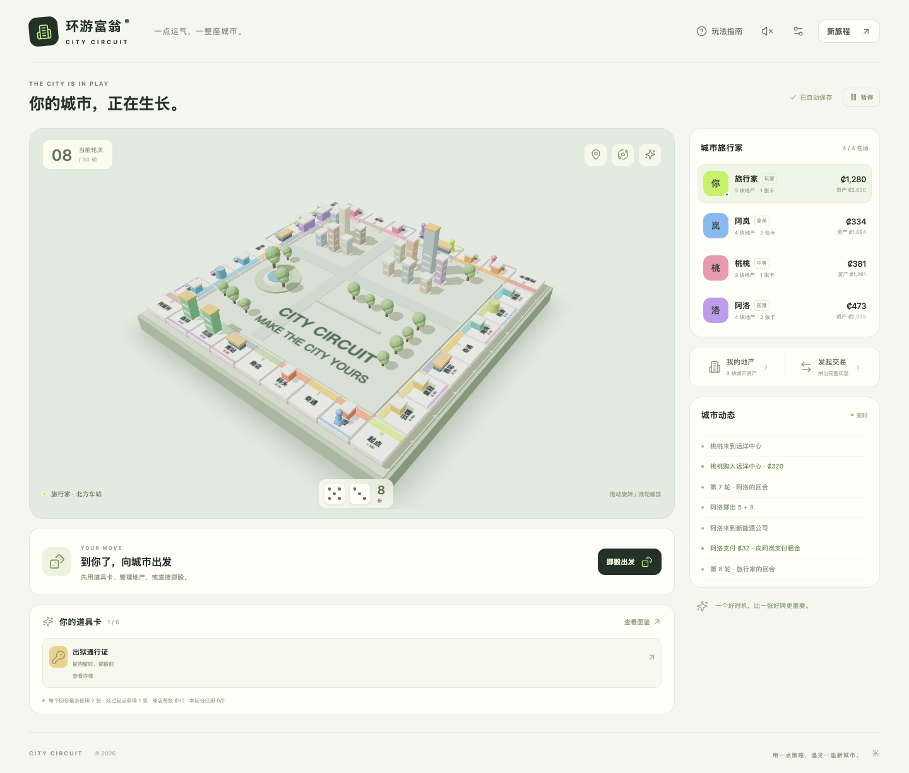

# 环游富翁 · City Circuit

一款可部署在 **Cloudflare Workers Static Assets** 的纯前端 3D 大富翁。1 位玩家与 3–5 位自动 NPC 在 32 格城市棋盘上购买地产、建房收租、竞拍交易，并使用道具改写局面。

React 19 + TypeScript + Vite + Three.js / React Three Fiber。规则、NPC、存档与音效全部在浏览器运行；无需游戏服务器、数据库、外部字体、图片生成接口或 API 密钥。



## 本地运行

需要 Node.js 22.12+。

```sh
npm ci
npm run dev
```

打开 http://127.0.0.1:5173。设置名字、3/4/5 位 NPC、每位 NPC 的难度和旅程长度，点击「开启新旅程」。

```sh
npm run build        # TypeScript 检查 + 生产构建
npm run preview      # 预览 dist
npm run cf:dev       # 构建后在本地 Workers 运行时预览，默认 :8787
```

## 部署到 Cloudflare Workers

仓库包含 `wrangler.jsonc`，直接将 `dist/` 作为 Worker 静态资源，并启用单页应用回退。没有服务端脚本和资源绑定。

```sh
npx wrangler login
npm run deploy
```

可先检查配置与部署产物：

```sh
npm run build
npx wrangler deploy --dry-run
```

如果使用 Cloudflare 控制台连接 Git 仓库，选择 Workers 项目，构建命令填 `npm run build`，部署命令填 `npx wrangler deploy`。Worker 名称在 `wrangler.jsonc` 中修改，当前为 `city-circuit`。自定义域名可在部署后通过 Worker 的域名设置绑定。

## 游戏内容

- **4–6 人局**：玩家 + 3–5 个自动 NPC；每位 NPC 独立选择简单、中等或困难。
- **完整地产系统**：8 个同色街区、16 块普通地产、4 座车站、2 家公共事业，成套租金、均衡建房、酒店、均衡卖楼、抵押、赎回。
- **传统回合规则**：双骰加掷、三次连续双骰拘留、保释与最多三次出狱尝试，奇遇、税款、公园奖池。
- **全员拍卖与交易**：放弃买地后拍卖，最低起拍价为原价 40%，每次至少加价 ₡10。可向 NPC 提出地产和现金交换，NPC 也会主动与其他 NPC 交易来成套。
- **资金不足处理**：卖楼、抵押筹款，再偿付欠款；破产资产转交债权人或银行。玩家破产后自动观战。
- **胜负结算**：20/30/50 轮按总资产排名，或自由模式直到只剩一人。总资产 = 现金 + 地产价格（抵押地产计 50%）+ 建筑原价；平局依现金、座位顺序。
- **本机自动存档**：每次动作后保存；刷新后首页可继续旅程。存档带版本、字段与状态关系校验，损坏存档不会启动。浏览器禁止存储时仍可游玩，界面会说明无法保存。
- **操作与显示**：拖动旋转、右键或 Shift + 拖动平移、滚轮缩放；触屏单指旋转、双指平移或缩放。三种视角，切换时回到棋盘中心；点击格子查看详情、可用键盘操作的全城市地图，响应式手机布局。WebGL 不可用时提供兼容棋盘。
- **节奏设置**：NPC 行动速度、自动回合暂停、可选合成音效。打开管理或规则弹窗时，NPC 暂时等待。

### NPC 难度

所有 NPC 使用相同初始现金、道具获取方式、骰子和支付规则，难度只改变策略。

| 难度 | 决策行为 |
| --- | --- |
| 简单 | 随性买地、较低竞拍预算、少用卡、保守建设，不主动交易 |
| 中等 | 保留现金、建设至三级、主动成套交易、赎回地产、使用保护卡 |
| 困难 | 依据对手租金保留现金，重视街区成套与车站连锁，建设酒店，计算遥控骰子/任意门的落点收益，针对高租金建筑拆迁 |

### 道具卡设计

**获取**：开局每人随机 2 张；每次经过起点获得 1 张；奇遇可能赠送 2 张；商店随机展示 3 张，每次可花 ₡90 购买其中 1 张。

**限制**：最多持有 6 张，免费抽卡溢出时改领 ₡30；每回合最多使用 2 张，双骰加掷不重置次数。使用后立即消耗，时机或目标不满足时禁止使用。

| 道具 | 生效规则 | 使用时机 |
| --- | --- | --- |
| 遥控骰子 | 指定 2–12 步，代替掷骰，正常领取经过起点的奖励；不触发双骰 | 掷骰前，未被拘留 |
| 任意门 | 传送到任意普通格并结算落点，不领取经过起点奖励，不可选择拘留令格 | 掷骰前，未被拘留 |
| 租金护盾 | 下次租金减半，向上取整，生效后移除；未生效前持续存在，不叠加 | 掷骰前 / 支付租金时 |
| 免租券 | 免除本次全部租金，房东也不收到钱 | 支付租金时 |
| 租金翻倍 | 指定自己未抵押地产，租金 ×2，持续到自己接下来的第 2 次回合开始 | 掷骰前 / 回合结束前 |
| 拆迁许可 | 拆除对手地产一级建筑，无退款；酒店降为四栋房屋 | 掷骰前 / 回合结束前 |
| 城市补助 | 立即领取 ₡150 | 掷骰前 / 回合结束前 |
| 资金转移 | 从一名对手可用现金中转移至多 ₡100，不强制出售其资产 | 掷骰前 / 回合结束前 |
| 出狱通行证 | 免费立即出狱，本回合继续正常掷骰 | 被拘留时、掷骰前 |

完整规则和卡牌说明也在游戏内「玩法指南」「道具图鉴」中提供。

## 验证

```sh
npm test
npx playwright install chromium
npm run test:e2e
```

也可在已启动的 Workers 本地服务上验证生产构建：

```sh
E2E_BASE_URL=http://127.0.0.1:8787 npm run test:e2e
```

规则测试覆盖地产、租金、拍卖、抵押赎回、交易、拘留与欠款续算、破产资产转交、胜利判定、9 种卡牌、道具获取与使用限制、损坏存档。还使用不同种子完成 **90 局 4–6 人限轮对局**，逐动作检查状态合法性、现金非负、资产归属与无卡死，并验证自由模式的最后幸存者胜利。

Playwright 使用真实 Chromium/WebGL，验证开局配置、掷骰购买、NPC 自动回合、暂停与刷新继续、用卡选目标、免租、建房卖楼抵押赎回、交易、商店、欠款偿付、拍卖、出狱、破产观战、城市地图、最终排名和手机布局。

## 代码结构

```text
src/game/data.ts       棋盘、街区、道具、难度配置
src/game/types.ts      游戏状态与动作类型
src/game/engine.ts     独立、确定性的规则状态机
src/game/ai.ts         按难度生成 NPC 决策
src/game/storage.ts    本机存档与恢复校验
src/components/Board.tsx  程序生成 3D 城市、棋子动画、兼容视图
src/components/GameUI.tsx 回合、资产、交易、卡牌、规则、结算
src/components/UI.tsx  弹窗焦点管理、图标、骰子
src/App.tsx            首页、自动回合调度、持久化与游戏界面
tests/engine.test.ts   规则与完整对局测试
tests/browser/        浏览器操作测试
wrangler.jsonc        Workers Static Assets 部署配置
```

城市建筑、树木、棋子与格子均由几何体和本机 Canvas 生成。3D 模块延迟加载，静止棋盘按需渲染，降低空闲时的 CPU/GPU 负担。随机数种子保存在状态中，恢复后继续同一条随机序列，便于复现规则问题。

存档限定于同一浏览器、同一站点，不跨设备同步；这是本地单人加 NPC 游戏，不包含在线联机。
